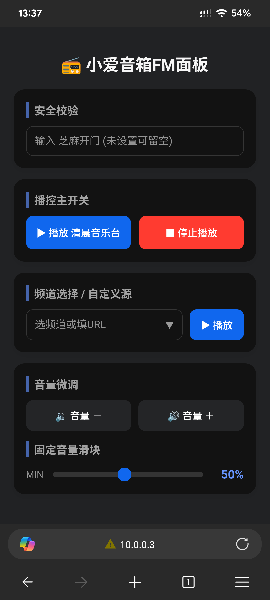

# Xiaomi Speaker Remote Controller (LX06/Compatible)

这是一个基于 Shell 脚本和 BusyBox 构建的轻量级小爱音箱控制系统。它通过在音箱上部署极简的 CGI Web 服务，让你能够通过浏览器远程控制音箱的播放、停止、音量调整，并支持自定义流媒体源（如直播源、网络广播等）。

## 界面预览



## 🚀 功能特性

* **极简架构**：仅由单一 Shell 脚本和 BusyBox 组成，不依赖复杂的环境，占用资源极小。
* **播控中心**：一键播放预设频道，一键停止，支持音量增量加减及精细化滑块控制。
* **自定义源管理**：内置 CCTV 电视直播流预设，支持手动添加并保存自定义媒体流链接，自动缓存最近使用的 100 个频道。
* **安全校验**：支持设置“芝麻开门”密钥，防止未授权访问。
* **移动端适配**：适配各种手机浏览器。
* **开放性**：支持GET传参请求触发。


## ⚙️ 准备工作

在开始部署本控制系统前，你的音箱需要先完成底层破解。

1. **刷机前提**：请参考 [Open-Xiaoai 刷机教程](https://github.com/idootop/open-xiaoai/blob/main/docs/flash.md) 完成音箱的 Root 权限获取及环境准备。
2. **固件要求**：请确保你的音箱已刷入兼容的 Open-Xiaoai 固件，可前往 [Open-Xiaoai Releases](https://github.com/idootop/open-xiaoai/releases) 下载最新版本。


## 📦 部署指南

1. 将本项目 `data` 目录下的文件全部上传至音箱的 `/data` 目录。
```bash
/data/init.sh                开机自启脚本
/data/root/fm/busybox        http服务
/data/root/fm/fm.sh          FM控制台服务
/data/root/.ssh/dropbear     可选，用于SSH禁止PASSWORD认证，只允许私钥认证

```

2. 赋予脚本执行权限：
```bash
chmod +x /data/init.sh
chmod +x /data/root/fm/*

```


3. **启动服务**（支持设置安全密钥）：
```bash
# 不开启安全校验
/data/root/fm/fm.sh start

# 开启安全校验 (将 AreYouOK 替换为你的密钥)
/data/root/fm/fm.sh start -auth AreYouOK

```


4. **访问控制台**：启动成功后，根据终端输出的 IP 地址，在浏览器访问 `http://<音箱IP>` 即可开始控制。


## 📝 控制命令说明

你可以通过以下命令管理后台服务：

* `/data/root/fm/fm.sh start` : 启动 Web 控制台。
* `/data/root/fm/fm.sh stop` : 停止服务并清理临时文件。


## 💡 注意事项

* 本系统旨在通过本地网络实现便捷控制，请确保音箱与访问设备处于同一局域网内。
* 自定义流链接建议使用标准的 `m3u8` 或 `mp3` 直链，以保证 `miplayer` 能顺利解析播放。
